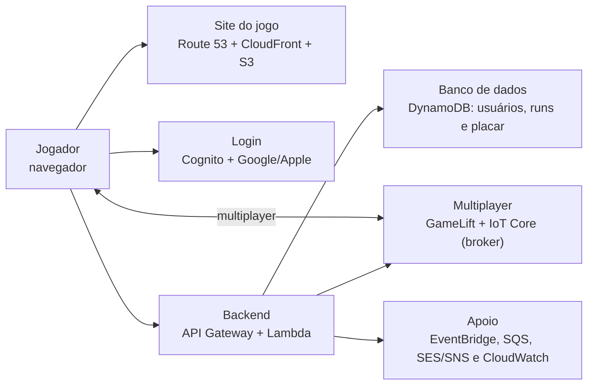

# Arquitetura de nuvem AWS

Esta é uma proposta simples de arquitetura para o jogo **Plataforma C: Escape from Floripa**. A ideia é colocar o jogo web na AWS, guardar usuários e placar com segurança e deixar preparado o caminho para o multiplayer.

## Diagrama

## Explicação

- **Site do jogo:** o jogador acessa um endereço do Route 53. O CloudFront entrega o frontend e os arquivos do jogo (imagens, sons e mapas), que ficam no S3. O CloudFront também fornece HTTPS.

- **Login:** o Cognito permite entrar com Google ou Apple. Depois do login, ele identifica o usuário para que cada tempo no placar fique associado à pessoa correta.

- **Backend:** o frontend chama a API REST no API Gateway. As funções Lambda executam as regras que precisam ficar na nuvem, como iniciar/finalizar uma run, salvar o tempo e consultar o placar. O DynamoDB guarda usuários, runs vencedoras e o ranking.

- **Placar:** somente runs vencidas são salvas. O banco consulta os tempos do menor para o maior; portanto, quem terminou mais rápido aparece primeiro. O tempo deve ser confirmado pelo backend/servidor, e não aceito diretamente do navegador.

- **Multiplayer:** o GameLift Servers é o serviço da AWS voltado a hospedar partidas. O IoT Core funciona como o **broker**: recebe mensagens dos jogadores e distribui as atualizações da partida. O GameLift valida as ações importantes, como vitória e derrota.

- **Notificações e logs:** quando algo importante acontece, como uma run concluída, o EventBridge e o SQS enviam o evento para processamento sem atrasar o jogo. SES pode enviar e-mails e SNS notificações. CloudWatch guarda logs e ajuda a encontrar erros.

