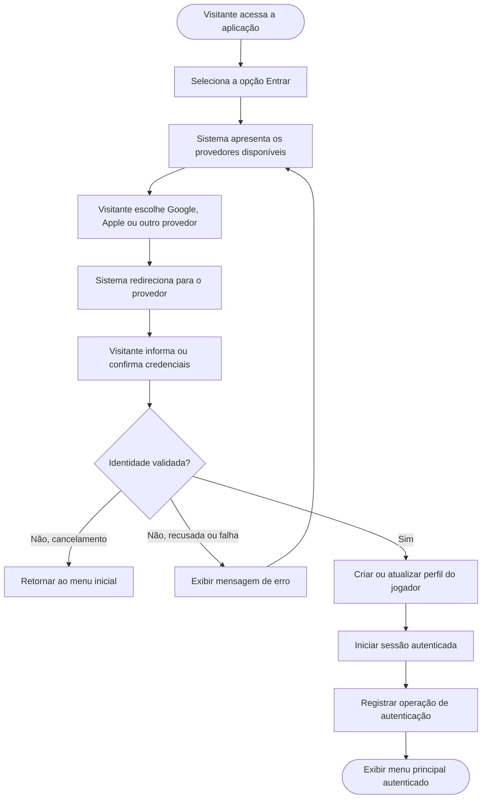

# UC01 — Autenticar jogador

```mermaid
flowchart TD
    A([Visitante acessa a aplicação]) --> B[Seleciona a opção Entrar]
    B --> C[Sistema apresenta os provedores disponíveis]
    C --> D[Visitante escolhe Google, Apple ou outro provedor]
    D --> E[Sistema redireciona para o provedor]
    E --> F[Visitante informa ou confirma credenciais]
    F --> G{Identidade validada?}
    G -- Não, cancelamento --> H[Retornar ao menu inicial]
    G -- Não, recusada ou falha --> I[Exibir mensagem de erro]
    I --> C
    G -- Sim --> J[Criar ou atualizar perfil do jogador]
    J --> K[Iniciar sessão autenticada]
    K --> L[Registrar operação de autenticação]
    L --> M([Exibir menu principal autenticado])
```
