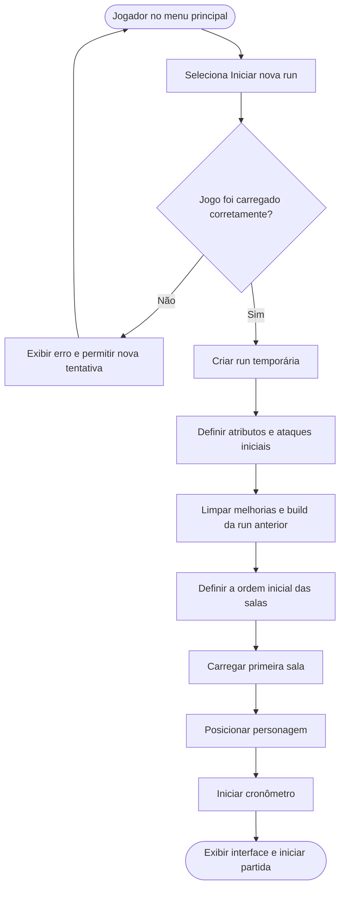

# UC02 — Iniciar nova run

```mermaid
flowchart TD
    A([Jogador no menu principal]) --> B[Seleciona Iniciar nova run]
    B --> C{Jogo foi carregado corretamente?}
    C -- Não --> D[Exibir erro e permitir nova tentativa]
    D --> A
    C -- Sim --> E[Criar run temporária]
    E --> F[Definir atributos e ataques iniciais]
    F --> G[Limpar melhorias e build da run anterior]
    G --> H[Definir a ordem inicial das salas]
    H --> I[Carregar primeira sala]
    I --> J[Posicionar personagem]
    J --> K[Iniciar cronômetro]
    K --> L([Exibir interface e iniciar partida])
```
