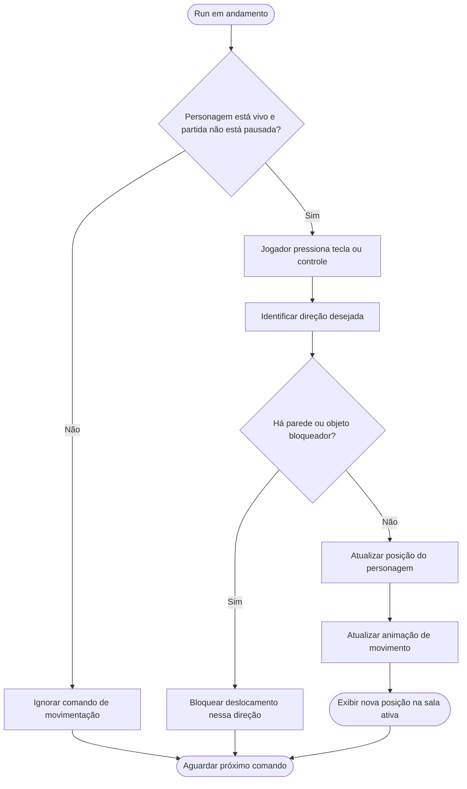

# UC03 — Controlar personagem

```mermaid
flowchart TD
    A([Run em andamento]) --> B{Personagem está vivo e partida não está pausada?}
    B -- Não --> C[Ignorar comando de movimentação]
    C --> Z([Aguardar próximo comando])
    B -- Sim --> D[Jogador pressiona tecla ou controle]
    D --> E[Identificar direção desejada]
    E --> F{Há parede ou objeto bloqueador?}
    F -- Sim --> G[Bloquear deslocamento nessa direção]
    G --> Z
    F -- Não --> H[Atualizar posição do personagem]
    H --> I[Atualizar animação de movimento]
    I --> J([Exibir nova posição na sala ativa])
    J --> Z
```
