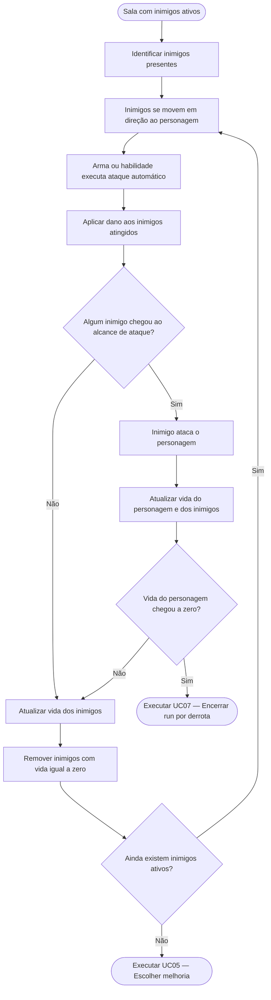

# UC04 — Combater inimigos

```mermaid
flowchart TD
    A([Sala com inimigos ativos]) --> B[Identificar inimigos presentes]
    B --> C[Inimigos se movem em direção ao personagem]
    C --> D[Arma ou habilidade executa ataque automático]
    D --> E[Aplicar dano aos inimigos atingidos]
    E --> F{Algum inimigo chegou ao alcance de ataque?}
    F -- Sim --> G[Inimigo ataca o personagem]
    F -- Não --> H[Atualizar vida dos inimigos]
    G --> I[Atualizar vida do personagem e dos inimigos]
    I --> J{Vida do personagem chegou a zero?}
    J -- Sim --> K([Executar UC07 — Encerrar run por derrota])
    J -- Não --> H
    H --> L[Remover inimigos com vida igual a zero]
    L --> M{Ainda existem inimigos ativos?}
    M -- Sim --> C
    M -- Não --> N([Executar UC05 — Escolher melhoria])
```
