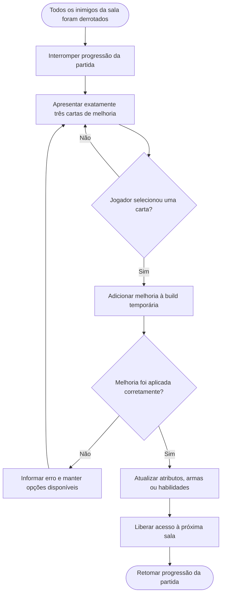

# UC05 — Escolher melhoria

```mermaid
flowchart TD
    A([Todos os inimigos da sala foram derrotados]) --> B[Interromper progressão da partida]
    B --> C[Apresentar exatamente três cartas de melhoria]
    C --> D{Jogador selecionou uma carta?}
    D -- Não --> C
    D -- Sim --> E[Adicionar melhoria à build temporária]
    E --> F{Melhoria foi aplicada corretamente?}
    F -- Não --> G[Informar erro e manter opções disponíveis]
    G --> C
    F -- Sim --> H[Atualizar atributos, armas ou habilidades]
    H --> I[Liberar acesso à próxima sala]
    I --> J([Retomar progressão da partida])
```
