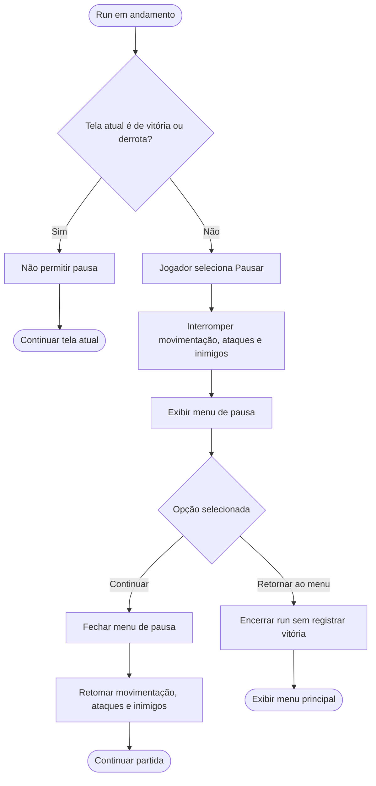

# UC06 — Pausar partida

```mermaid
flowchart TD
    A([Run em andamento]) --> B{Tela atual é de vitória ou derrota?}
    B -- Sim --> C[Não permitir pausa]
    C --> Z([Continuar tela atual])
    B -- Não --> D[Jogador seleciona Pausar]
    D --> E[Interromper movimentação, ataques e inimigos]
    E --> F[Exibir menu de pausa]
    F --> G{Opção selecionada}
    G -- Continuar --> H[Fechar menu de pausa]
    H --> I[Retomar movimentação, ataques e inimigos]
    I --> J([Continuar partida])
    G -- Retornar ao menu --> K[Encerrar run sem registrar vitória]
    K --> L([Exibir menu principal])
```
